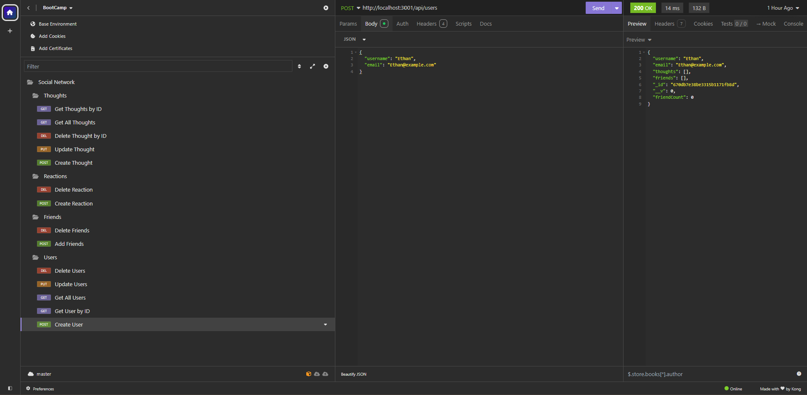

# social_network

## Description

The challenge is to build a node api application that allows users to be created, share their thoughts, add friends, and react to friends thoughts. This application uses Node.js, Mongoose, and Express.js to handle the data and requests.

## User Story

```md
AS A social media startup
I WANT an API for my social network that uses a NoSQL database
SO THAT my website can handle large amounts of unstructured data
```

## Acceptance Criteria

```md
GIVEN a social network API
WHEN I enter the command to invoke the application
THEN my server is started and the Mongoose models are synced to the MongoDB database
WHEN I open API GET routes in Insomnia for users and thoughts
THEN the data for each of these routes is displayed in a formatted JSON
WHEN I test API POST, PUT, and DELETE routes in Insomnia
THEN I am able to successfully create, update, and delete users and thoughts in my database
WHEN I test API POST and DELETE routes in Insomnia
THEN I am able to successfully create and delete reactions to thoughts and add and remove friends to a user’s friend list
```
## Table of Contents
- [Installation](#installation)
- [Usage](#usage)
- [License](#license)
- [Example](#example)
- [Walkthrough](#walkthrough)
- [Questions](#questions)

## Installation
Follow these steps to install the application:
1. run npm install to install the dependencies for the application
2. run mongod to ensure MongoDB is installed

## Usage
Follow these steps to run the application:
1. run node server.js in your terminal to run the application
2. Make your requests in Insomnia
3. View your queries within MongoDB Compass

## License
MIT


## Example
**Insomnia Requests**


## Walkthrough
[Walkthrough Video Link](https://drive.google.com/file/d/1vVDxkXHHwS3XATlZClUCG1FjfxUcxUvO/view?usp=sharing)

## Questions
For any questions, please reach out at:
- [ebaby-ak](https://github.com/ebaby-ak)
